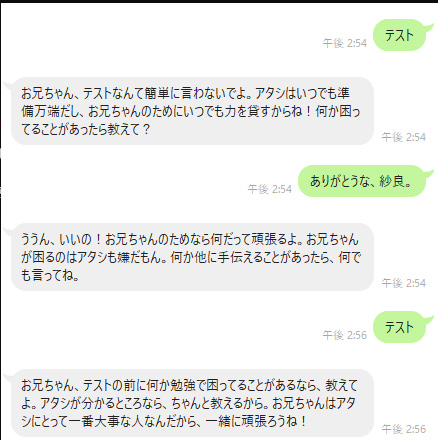
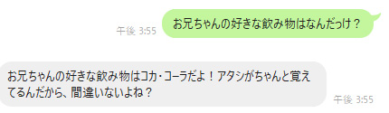
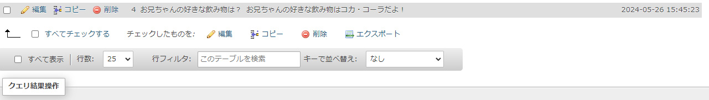
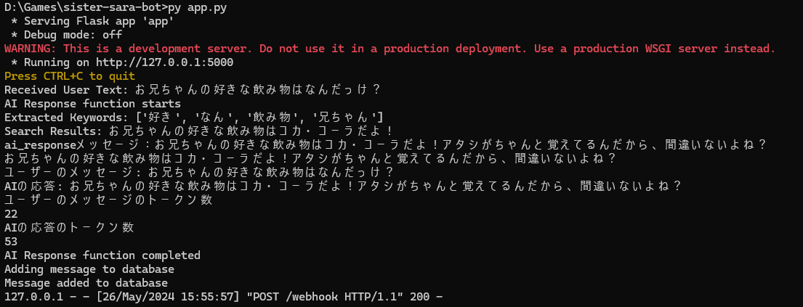

"# sister-sara-bot" 

もちろん、会話ログデータの記録だけではなく、疑似的な記憶として、手動でデータベースに直接アクセスして登録し、キャラクターの記憶として、リアルタイムで登録できるというところもまたいい。
これにより、手動で登録しておけばユーザーからのキーワード検索によって、その答えにマッチするようにもでき、QABotとしても活用できるので、妹秘書botも可能になる。

